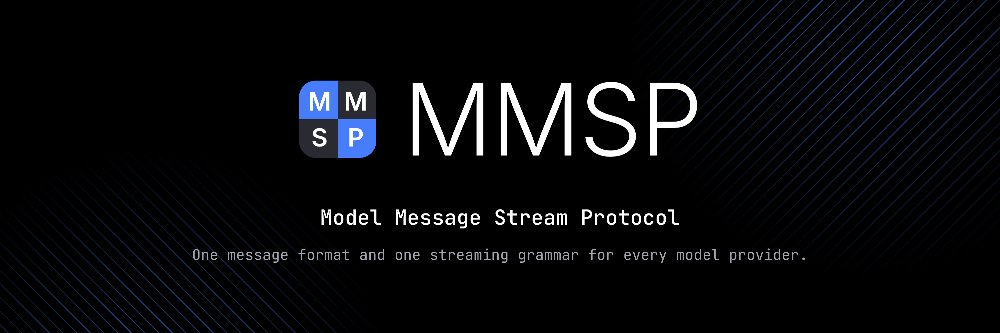
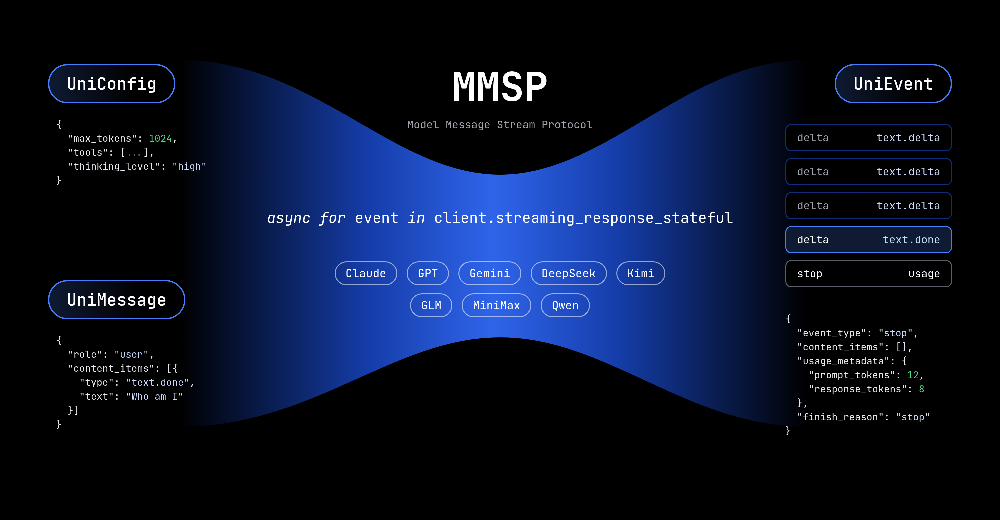
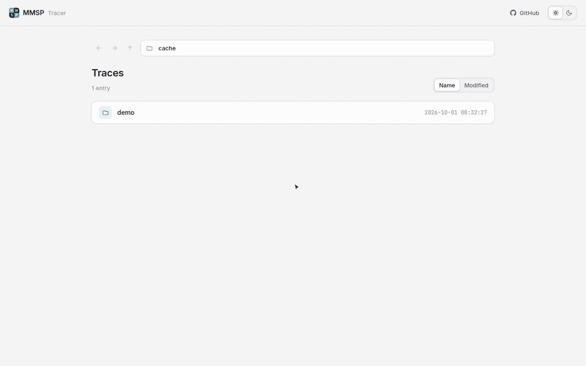
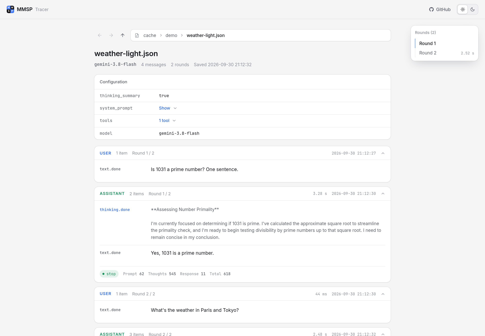
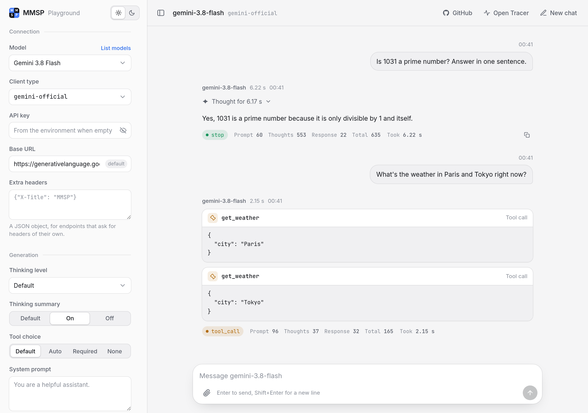

# MMSP - Model Message Stream Protocol

[](https://github.com/Prism-Shadow/model-message-stream-protocol/stargazers)
[](https://github.com/Prism-Shadow/model-message-stream-protocol/commits/main)
[](https://github.com/Prism-Shadow/model-message-stream-protocol/graphs/contributors)
[](https://github.com/Prism-Shadow/model-message-stream-protocol/actions/workflows/pytest.yml)
[](https://github.com/Prism-Shadow/model-message-stream-protocol/actions/workflows/jest.yml)
[](https://pypi.org/project/mmsp/)
[](https://www.npmjs.com/package/@prismshadow/mmsp)

**Integrate every model the same way, and keep one API in your head instead of one per provider.**

MMSP, the Model Message Stream Protocol, takes the per-provider differences off a developer's mind: one message format and one streaming grammar for every model provider, in Python and TypeScript.

📖 Documentation: [mmsp.penguin.ooo](https://mmsp.penguin.ooo)

Using a coding agent? Install the MMSP SKILL files from [`skills/`](skills/) so it can use MMSP correctly in generated code.

📢 Follow us on [](https://x.com/code_hiyouga) or join our [](https://discord.gg/eFHKqqcU3D)

## Why MMSP?

- 🔗 **Unified**: A consistent and intuitive interface for developing **agents** across different LLMs.

- 🎯 **Precise**: Automatically handles **[interleaved thinking](https://platform.claude.com/docs/en/build-with-claude/extended-thinking#interleaved-thinking)** during multi-step tool calls, preventing performance degradation.

- 🧭 **Traceable**: Provides lightweight yet fine-grained **tracing** for debugging and auditing LLM executions.

## Features

### AutoLLMClient (Python & TypeScript)

Switch different LLMs with **zero code changes** and **no performance loss**.



### Built-in Observability

Audit LLM executions by adding **a single `trace_id` parameter**, no database required.



## Supported Models

| Model Name     | Vendor                              | Example Model ID       | Input Modalities | Output Modalities              |
| -------------- | ----------------------------------- | ---------------------- | ---------------- | ------------------------------ |
| Gemini 3-3.8   | Official/Google Vertex AI           | `gemini-3.8-flash`     | Text, Image      | Text, Image, Speech, Embedding |
| Claude 4.6-5.5 | Official/Amazon Bedrock/UModelVerse | `claude-opus-5-5`      | Text, Image      | Text                           |
| GPT-5.4-6.1    | Official/OpenRouter/UModelVerse     | `gpt-6.1-sol`          | Text, Image      | Text, Embedding                |
| Kimi-K2.5/K2.6/K3 | Official/OpenRouter/SiliconFlow  | `kimi-k3`              | Text, Image      | Text                           |
| DeepSeek V4    | Official/OpenRouter/SiliconFlow     | `deepseek-flash`       | Text, Image      | Text                           |
| GLM-5.1-5.3    | Official/OpenRouter/SiliconFlow     | `glm-5.3`              | Text, Image      | Text                           |
| MiniMax-M3     | Official                            | `MiniMax-M3`           | Text, Image      | Text                           |
| Qwen3.8        | OpenRouter/SiliconFlow/vLLM         | `qwen/qwen3.8-27b`     | Text, Image      | Text, Embedding                |

### Clients

`AutoLLMClient` takes a model id and a `client_type`. An **official client** speaks its
vendor's own API, knows the vendor's models, and reads the vendor's key from the environment;
a **compatible client** speaks one wire protocol for any endpoint that serves it.

| `client_type`              | Speaks                                                                 | Key and endpoint                         |
| -------------------------- | ---------------------------------------------------------------------- | ---------------------------------------- |
| `openai-official`          | OpenAI Responses; `text-embedding-*` models through OpenAI Embeddings  | `OPENAI_API_KEY`, `OPENAI_BASE_URL`      |
| `anthropic-official`       | Anthropic Messages                                                     | `ANTHROPIC_API_KEY`, `ANTHROPIC_BASE_URL` |
| `google-official`          | Gemini Interactions                                                    | `GEMINI_API_KEY`, `GEMINI_BASE_URL`      |
| `zai-official`             | Z.AI Chat Completions                                                  | `ZAI_API_KEY`, `ZAI_BASE_URL`            |
| `moonshot-official`        | Moonshot Chat Completions                                              | `MOONSHOT_API_KEY`, `MOONSHOT_BASE_URL`  |
| `deepseek-official`        | DeepSeek Responses                                                     | `DEEPSEEK_API_KEY`, `DEEPSEEK_BASE_URL`  |
| `minimax-official`         | MiniMax Responses                                                      | `MINIMAX_API_KEY`, `MINIMAX_BASE_URL`    |
| `openai-responses`         | OpenAI Responses, served by OpenAI, OpenRouter, DeepSeek, Z.AI, MiniMax | `OPENAI_API_KEY`, `OPENAI_BASE_URL`      |
| `openai-chat` (`openai`)   | OpenAI Chat Completions, served by most gateways, SiliconFlow, vLLM    | `OPENAI_API_KEY`, `OPENAI_BASE_URL`      |
| `openai-chat-vllm-adapter` | Chat Completions as vLLM serves it, mapping `thinking_level` onto the template's switches | `OPENAI_API_KEY`, `OPENAI_BASE_URL` |
| `openai-embedding`         | OpenAI Embeddings, served by any embedding endpoint                    | `OPENAI_API_KEY`, `OPENAI_BASE_URL`      |
| `ant-messages`             | Anthropic Messages, served by Anthropic, OpenRouter, DeepSeek, Z.AI, MiniMax | `ANTHROPIC_API_KEY`, `ANTHROPIC_BASE_URL` |
| `google-genai`             | Google generateContent, served by Vertex AI, the Gemini API, and gateways that proxy it | `GEMINI_API_KEY`, `GEMINI_BASE_URL` |
| `mmsp`                     | MMSP itself, served by an [MMSP server](#mmsp-server)                  | `MMSP_API_KEY`, `MMSP_BASE_URL`          |

`client_type` may be omitted for a model id that begins with a known family: `gpt-` and
`text-embedding-` route to `openai-official`, `claude-` to `anthropic-official`, `gemini-` to
`google-official`, `glm-` to `zai-official`, `kimi-` to `moonshot-official`, `deepseek-` to
`deepseek-official`, `minimax-` to `minimax-official`. Any other id raises and asks for a
`client_type`. The `CLIENT_TYPE` environment variable names one for every client the code does
not.

Gemini on Google Vertex AI takes `client_type="google-genai"` and the service-account JSON key as
the API key: Vertex AI's Interactions endpoint, which `google-official` speaks, serves none of these
models.

Where a gateway serves more than one protocol, prefer `"openai-responses"`: OpenRouter serves it
for every model it hosts, while SiliconFlow serves Chat Completions only.

The full machine-readable list — model, base URL, client, input/output modalities, context
window, and per-million-token list pricing in USD or CNY:

```python
from mmsp import list_supported_models

models = list_supported_models(currency="CNY")  # "USD" by default
```

```typescript
import { listSupportedModels } from "@prismshadow/mmsp";

const models = listSupportedModels("CNY"); // "USD" by default
```

## Installation

### Python package

Install from PyPI:

```bash
uv add mmsp
# or
pip install mmsp
```

Build from source:

```bash
cd src_py && make
```

See [src_py/README.md](src_py/README.md) for comprehensive usage examples and API documentation.

### TypeScript package

Install from npm:

```bash
npm install @prismshadow/mmsp
```

Build from source:

```bash
cd src_ts && make install && make build
```

See [src_ts/README.md](src_ts/README.md) for comprehensive usage examples and API documentation.

## Agent Skills

MMSP provides Codex/Claude Code skill files for assistants that need to help users consume the SDK packages:

- Python skill: [`skills/mmsp-python/SKILL.md`](skills/mmsp-python/SKILL.md)
- TypeScript skill: [`skills/mmsp-typescript/SKILL.md`](skills/mmsp-typescript/SKILL.md)

## APIs

`AutoLLMClient` is the main class for interacting with the MMSP SDK. It is constructed with `model` and `client_type` (see [Clients](#clients); a model id of a known family names its official client on its own), plus optional `api_key`, `base_url`, and `default_headers` — headers sent with every request, for endpoints that demand their own. It provides the following methods:

A key goes only where it was given for: a client reads `OPENAI_API_KEY` / `ANTHROPIC_API_KEY` from the environment only together with `OPENAI_BASE_URL` / `ANTHROPIC_BASE_URL` (or the provider's own endpoint), so a `base_url` passed in needs an `api_key` passed in with it, or the client raises at construction. A vendor client (`deepseek-v4`, `glm-5.x`, `kimi-k*`, `minimax-m3`, Gemini) reads its own variable, whatever endpoint it is given.

- `(async) streaming_response(messages, config)`: Streams the response of LLMs in a stateless manner.
- `(async) streaming_response_stateful(message, config)`: Streams the response of LLMs in a stateful manner.
- `(async) list_models()`: Lists the model ids the configured endpoint serves. A protocol client (`openai-chat`, `openai-chat-vllm-adapter`, `openai-responses`, `ant-messages`, `openai-embedding`, `google-genai`, `mmsp`) is named explicitly and lists everything the endpoint serves; a client deduced from a model id lists only the ids that deduce back to it.
- `clear_history()`: Clears the history of the stateful LLM client.
- `get_history()`: Returns the history of the stateful LLM client.
- `set_history(history)`: Replaces the history of the stateful LLM client with a copy of the provided list.

Both streaming methods yield `delta` events, each carrying one content item, followed by exactly one `stop` event that carries the usage and the finish reason (see [UniEvent](#unievent)).

Streaming clients skip output they do not recognize, so a gateway's own frames cannot end a generation. Set `MMSP_DEBUG` to anything other than `0`, `false`, `no` or `off` to make it raise instead.

## Basic Usage

> [!NOTE]
> We recommend using the **stateful interface** when calling the MMSP SDK.

### OpenAI GPT-5.6

Python Example:

```python
import asyncio
import os
from mmsp import AutoLLMClient

os.environ["OPENAI_API_KEY"] = "your-openai-api-key"

async def main():
    client = AutoLLMClient(model="gpt-5.6-sol")
    async for event in client.streaming_response_stateful(
        message={
            "role": "user",
            "content_items": [{"type": "text.done", "text": "Say 'Hello, World!'"}]
        },
        config={"temperature": 1.0}
    ):
        print(event)

asyncio.run(main())
# {'role': 'assistant', 'event_type': 'delta', 'content_items': [{'type': 'text.delta', 'text': 'Hello'}], 'usage_metadata': None, 'finish_reason': None}
# {'role': 'assistant', 'event_type': 'delta', 'content_items': [{'type': 'text.delta', 'text': ','}], 'usage_metadata': None, 'finish_reason': None}
# {'role': 'assistant', 'event_type': 'delta', 'content_items': [{'type': 'text.delta', 'text': ' World'}], 'usage_metadata': None, 'finish_reason': None}
# {'role': 'assistant', 'event_type': 'delta', 'content_items': [{'type': 'text.delta', 'text': '!'}], 'usage_metadata': None, 'finish_reason': None}
# {'role': 'assistant', 'event_type': 'delta', 'content_items': [{'type': 'text.done', 'text': 'Hello, World!'}], 'usage_metadata': None, 'finish_reason': None}
# {'role': 'assistant', 'event_type': 'stop', 'content_items': [], 'usage_metadata': {'cached_tokens': 0, 'prompt_tokens': 12, 'thoughts_tokens': 0, 'response_tokens': 8}, 'finish_reason': 'stop'}
```

TypeScript Example:

```typescript
import { AutoLLMClient } from "@prismshadow/mmsp";

process.env.OPENAI_API_KEY = "your-openai-api-key";

async function main() {
  const client = new AutoLLMClient({ model: "gpt-5.6-sol" });
  for await (const event of client.streamingResponseStateful({
    message: {
      role: "user",
      content_items: [{ type: "text.done", text: "Say 'Hello, World!'" }]
    },
    config: {}
  })) {
    console.log(event);
  }
}

main().catch(console.error);
// {'role': 'assistant', 'event_type': 'delta', 'content_items': [{'type': 'text.delta', 'text': 'Hello'}], 'usage_metadata': null, 'finish_reason': null}
// {'role': 'assistant', 'event_type': 'delta', 'content_items': [{'type': 'text.delta', 'text': ','}], 'usage_metadata': null, 'finish_reason': null}
// {'role': 'assistant', 'event_type': 'delta', 'content_items': [{'type': 'text.delta', 'text': ' World'}], 'usage_metadata': null, 'finish_reason': null}
// {'role': 'assistant', 'event_type': 'delta', 'content_items': [{'type': 'text.delta', 'text': '!'}], 'usage_metadata': null, 'finish_reason': null}
// {'role': 'assistant', 'event_type': 'delta', 'content_items': [{'type': 'text.done', 'text': 'Hello, World!'}], 'usage_metadata': null, 'finish_reason': null}
// {'role': 'assistant', 'event_type': 'stop', 'content_items': [], 'usage_metadata': {'cached_tokens': 0, 'prompt_tokens': 12, 'thoughts_tokens': 0, 'response_tokens': 8}, 'finish_reason': 'stop'}
```

### Anthropic Claude Opus 5

<details><summary><strong>Python Example</strong></summary>

```python
import asyncio
import os
from mmsp import AutoLLMClient

os.environ["ANTHROPIC_API_KEY"] = "your-anthropic-api-key"

async def main():
    client = AutoLLMClient(model="claude-opus-5")
    async for event in client.streaming_response_stateful(
        message={
            "role": "user",
            "content_items": [{"type": "text.done", "text": "Say 'Hello, World!'"}]
        },
        config={}
    ):
        print(event)

asyncio.run(main())
```

</details>

<details><summary><strong>TypeScript Example</strong></summary>

```typescript
import { AutoLLMClient } from "@prismshadow/mmsp";

process.env.ANTHROPIC_API_KEY = "your-anthropic-api-key";

async function main() {
  const client = new AutoLLMClient({ model: "claude-opus-5" });
  for await (const event of client.streamingResponseStateful({
    message: {
      role: "user",
      content_items: [{"type": "text.done", "text": "Say 'Hello, World!'"}]
    },
    config: {}
  })) {
    console.log(event);
  }
}

main().catch(console.error);
```

</details>

### OpenRouter GLM-5.3

<details><summary><strong>Python Example</strong></summary>

```python
import asyncio
import os
from mmsp import AutoLLMClient

os.environ["ZAI_API_KEY"] = "your-openrouter-api-key"
os.environ["ZAI_BASE_URL"] = "https://openrouter.ai/api/v1"

async def main():
    client = AutoLLMClient(model="z-ai/glm-5.3")
    async for event in client.streaming_response_stateful(
        message={
            "role": "user",
            "content_items": [{"type": "text.done", "text": "Say 'Hello, World!'"}]
        },
        config={}
    ):
        print(event)

asyncio.run(main())
```

</details>
<details><summary><strong>TypeScript Example</strong></summary>

```typescript
import { AutoLLMClient } from "@prismshadow/mmsp";

process.env.ZAI_API_KEY = "your-openrouter-api-key";
process.env.ZAI_BASE_URL = "https://openrouter.ai/api/v1";

async function main() {
  const client = new AutoLLMClient({ model: "z-ai/glm-5.3" });
  for await (const event of client.streamingResponseStateful({
    message: {
      role: "user",
      content_items: [{"type": "text.done", "text": "Say 'Hello, World!'"}]
    },
    config: {}
  })) {
    console.log(event);
  }
}

main().catch(console.error);
```
</details>

### SiliconFlow Qwen3.8 27B via OpenAI-compatible API

<details><summary><strong>Python Example</strong></summary>

```python
import asyncio
import os
from mmsp import AutoLLMClient

os.environ["OPENAI_API_KEY"] = "your-siliconflow-api-key"
os.environ["OPENAI_BASE_URL"] = "https://api.siliconflow.cn/v1"

async def main():
    client = AutoLLMClient(model="Qwen/Qwen3.8-27B", client_type="openai-chat")
    async for event in client.streaming_response_stateful(
        message={
            "role": "user",
            "content_items": [{"type": "text.done", "text": "Say 'Hello, World!'"}]
        },
        config={}
    ):
        print(event)

asyncio.run(main())
```

</details>
<details><summary><strong>TypeScript Example</strong></summary>

```typescript
import { AutoLLMClient } from "@prismshadow/mmsp";

process.env.OPENAI_API_KEY = "your-siliconflow-api-key";
process.env.OPENAI_BASE_URL = "https://api.siliconflow.cn/v1";

async function main() {
  const client = new AutoLLMClient({
    model: "Qwen/Qwen3.8-27B",
    clientType: "openai-chat",
  });
  for await (const event of client.streamingResponseStateful({
    message: {
      role: "user",
      content_items: [{ type: "text.done", text: "Say 'Hello, World!'" }],
    },
    config: {}
  })) {
    console.log(event);
  }
}

main().catch(console.error);
```
</details>

### SiliconFlow Qwen3 Embedding 0.6B via OpenAI-compatible API

<details><summary><strong>Python Example</strong></summary>

```python
import asyncio
import os
from mmsp import AutoLLMClient

os.environ["OPENAI_API_KEY"] = "your-siliconflow-api-key"
os.environ["OPENAI_BASE_URL"] = "https://api.siliconflow.cn/v1"

async def main():
    client = AutoLLMClient(model="Qwen/Qwen3-Embedding-0.6B", client_type="openai-embedding")

    async for event in client.streaming_response_stateful(
        message={
            "role": "user",
            "content_items": [{"type": "text.done", "text": "Hello world"}],
        },
        config={},
    ):
        print(event)

asyncio.run(main())
```
</details>

<details><summary><strong>TypeScript Example</strong></summary>

```typescript
import { AutoLLMClient } from "@prismshadow/mmsp";

process.env.OPENAI_API_KEY = "your-siliconflow-api-key";
process.env.OPENAI_BASE_URL = "https://api.siliconflow.cn/v1";

async function main() {
  const client = new AutoLLMClient({
    model: "Qwen/Qwen3-Embedding-0.6B",
    clientType: "openai-embedding",
  });
  for await (const event of client.streamingResponseStateful({
    message: {
      role: "user",
      content_items: [{ type: "text.done", text: "Hello world" }],
    },
    config: {},
  })) {
    console.log(event);
  }
}

main().catch(console.error);
```
</details>

### DeepSeek via the OpenAI Responses protocol

Any compatible endpoint can be called through the generic protocol clients by picking the
client type (`openai-chat` / `openai-responses` / `ant-messages`) and the provider's base
URL for that protocol:

<details><summary><strong>Python Example</strong></summary>

```python
import asyncio
import os
from mmsp import AutoLLMClient

async def main():
    client = AutoLLMClient(
        model="deepseek-v4-flash",
        api_key=os.environ["DEEPSEEK_API_KEY"],
        base_url="https://api.deepseek.com",
        client_type="openai-responses",
    )
    async for event in client.streaming_response_stateful(
        message={
            "role": "user",
            "content_items": [{"type": "text.done", "text": "Say 'Hello, World!'"}]
        },
        config={}
    ):
        print(event)

asyncio.run(main())
```
</details>

<details><summary><strong>TypeScript Example</strong></summary>

```typescript
import { AutoLLMClient } from "@prismshadow/mmsp";

async function main() {
  const client = new AutoLLMClient({
    model: "deepseek-v4-flash",
    apiKey: process.env.DEEPSEEK_API_KEY,
    baseUrl: "https://api.deepseek.com",
    clientType: "openai-responses",
  });
  for await (const event of client.streamingResponseStateful({
    message: {
      role: "user",
      content_items: [{ type: "text.done", text: "Say 'Hello, World!'" }],
    },
    config: {},
  })) {
    console.log(event);
  }
}

main();
```
</details>

### DeepSeek via the Anthropic Messages protocol

<details><summary><strong>Python Example</strong></summary>

```python
import asyncio
import os
from mmsp import AutoLLMClient

async def main():
    client = AutoLLMClient(
        model="deepseek-v4-flash",
        api_key=os.environ["DEEPSEEK_API_KEY"],
        base_url="https://api.deepseek.com/anthropic",
        client_type="ant-messages",
    )
    async for event in client.streaming_response_stateful(
        message={
            "role": "user",
            "content_items": [{"type": "text.done", "text": "Say 'Hello, World!'"}]
        },
        config={}
    ):
        print(event)

asyncio.run(main())
```
</details>

<details><summary><strong>TypeScript Example</strong></summary>

```typescript
import { AutoLLMClient } from "@prismshadow/mmsp";

async function main() {
  const client = new AutoLLMClient({
    model: "deepseek-v4-flash",
    apiKey: process.env.DEEPSEEK_API_KEY,
    baseUrl: "https://api.deepseek.com/anthropic",
    clientType: "ant-messages",
  });
  for await (const event of client.streamingResponseStateful({
    message: {
      role: "user",
      content_items: [{ type: "text.done", text: "Say 'Hello, World!'" }],
    },
    config: {},
  })) {
    console.log(event);
  }
}

main();
```
</details>

The same model works over `client_type="openai-chat"` (base URL
`https://api.deepseek.com`); OpenRouter, Z.AI, and MiniMax expose all three protocols the
same way.

## Concepts: UniConfig, UniMessage and UniEvent

### UniConfig

UniConfig is an object that contains the configuration for LLMs.

Example UniConfig:

```json
{
  "max_tokens": 1024,
  "temperature": 1.0,
  "tools": [
    {
      "name": "get_current_weather",
      "description": "Get the current weather in a given location",
      "parameters": {
          "type": "object",
          "properties": {
              "location": {
                  "type": "string",
                  "description": "The city and state, e.g. San Francisco, CA"
              }
          },
          "required": ["location"]
      }
    }
  ],
  "thinking_summary": true,
  "thinking_level": "none | low | medium | high | xhigh | max",
  "tool_choice": "auto | required | none | a list of allowed tool names",
  "system_prompt": "You are a helpful assistant.",
  "prompt_caching": "enable | disable | enhance",
  "fast_mode": false,
  "image_config": {"aspect_ratio": "4:3", "image_size": "1K"},
  "tts_config": [{"voice": "Kore"}],
  "embedding_config": {"dimensions": 768},
  "trace_id": null
}
```

### UniMessage

UniMessage is an object that contains the input for LLMs. Its content items are complete items, typed with a `.done` suffix.

Example UniMessage:

```json
{
  "role": "user | assistant",
  "content_items": [
    {"type": "text.done", "text": "How are you doing?"},
    {"type": "image_url.done", "image_url": "https://example.com/image.jpg"},
    {"type": "inline_data.done", "mime_type": "image/jpeg", "data": "base64-encoded-image"},
    {"type": "thinking.done", "thinking": "I am thinking.", "fidelity": {"signature": "0x123456"}},
    {"type": "inline_thinking.done", "mime_type": "image/jpeg", "data": "base64-encoded-image"},
    {"type": "tool_call.done", "name": "math", "arguments": {"expression": "2 + 3"}, "tool_call_id": "123"},
    {"type": "tool_result.done", "text": "2 + 3 = 5", "images": [], "tool_call_id": "123"}
  ]
}
```

Messages saved before 0.5.0 use item types without the `.done` suffix. They are still accepted, and converted with a deprecation warning, until 0.6.0; `normalize_legacy_messages` / `normalizeLegacyMessages` converts stored data.

### UniEvent

UniEvent is an object that contains streaming output of LLMs. A stream is a run of `delta` events, each carrying exactly one content item, closed by exactly one `stop` event that carries no items but always the usage and the finish reason. Each item streams as one or more `.delta` fragments followed by its complete `.done` item, and items never interleave.

Example UniEvents for a tool call:

```jsonl
{"role": "assistant", "event_type": "delta", "content_items": [{"type": "tool_call.delta", "name": "math", "arguments": "{\"expression\": ", "tool_call_id": "123"}], "usage_metadata": null, "finish_reason": null, "created_at": 1694502400000}
{"role": "assistant", "event_type": "delta", "content_items": [{"type": "tool_call.delta", "name": "", "arguments": "\"2 + 3\"}", "tool_call_id": ""}], "usage_metadata": null, "finish_reason": null, "created_at": 1694502400010}
{"role": "assistant", "event_type": "delta", "content_items": [{"type": "tool_call.done", "name": "math", "arguments": {"expression": "2 + 3"}, "tool_call_id": "123"}], "usage_metadata": null, "finish_reason": null, "created_at": 1694502400010}
{"role": "assistant", "event_type": "stop", "content_items": [], "usage_metadata": {"cached_tokens": null, "prompt_tokens": 10, "thoughts_tokens": null, "response_tokens": 12}, "finish_reason": "tool_call", "created_at": 1694502400020}
```

Read complete items, such as tool calls, from the `.done` items, and the usage from the `stop` event.

## Token Usage

MMSP provides detailed token usage information through the `usage_metadata` field of the `stop` event, the last event of every stream.

The `usage_metadata` object contains four fields:
- `cached_tokens`: Cached input tokens
- `prompt_tokens`: Non-cached input tokens
- `thoughts_tokens`: Chain-of-thought output tokens
- `response_tokens`: Non-chain-of-thought output tokens

You can calculate the total token usage as follows:
- `input_tokens = cached_tokens + prompt_tokens`
- `output_tokens = thoughts_tokens + response_tokens`
- `total_tokens = input_tokens + output_tokens`

```
█████████████  ░░░░░░░░░░░░░ → LLM → ███████████████  ░░░░░░░░░░░░░░░
cached_tokens  prompt_tokens         thoughts_tokens  response_tokens
        input_tokens                          output_tokens
```

## Tracing LLM Executions



We provide a tracer to help you monitor and debug your LLM executions. You can enable tracing by setting the `trace_id` parameter to a unique identifier in the `config` object.

```python
async for event in client.streaming_response_stateful(
    message={
        "role": "user",
        "content_items": [{"type": "text.done", "text": "Say 'Hello, World!'"}]
    },
    config={"trace_id": "unique-trace-id"}
):
    print(event)
```

```bash
cd src_py && uv run python -m mmsp.integration.tracer --host 127.0.0.1 --port 25750
```

```bash
cd src_ts && npm run tracer
```

Then you can view the tracing output in the dashboard at `http://localhost:25750/`.

## LLM Playground



We provide a LLM playground to help you test your LLMs.

```bash
cd src_py && uv run python -m mmsp.integration.playground --host 127.0.0.1 --port 25751
```

```bash
cd src_ts && npm run playground
```

You can access the playground at `http://localhost:25751/`.
The integrated tracer is available at `http://localhost:25751/tracer/`.
The server page at `http://localhost:25751/server/` saves its table to `MMSP_SERVER_CONFIG` (else `cache/server.json`), starts an MMSP server from it and shows what it serves: a card per model, requests, outcomes, latency and throughput over time.

## MMSP Server

The MMSP server serves the models of a table over HTTP as MMSP streams. Each row maps an upstream model to the id clients name; the upstream keys stay on the server, and clients send one of the server's own keys.

```json
{
  "models": [
    {"model_id": "claude-sonnet-5-5", "api_key": "$ANTHROPIC_API_KEY", "server_model_id": "claude"},
    {"model_id": "qwen/qwen3.8-27b", "base_url": "https://openrouter.ai/api/v1", "api_key": "$OPENROUTER_API_KEY", "server_model_id": "qwen3.8", "client_type": "openai-responses"}
  ],
  "api_keys": ["$MMSP_SERVER_API_KEY"]
}
```

```bash
cd src_py && uv run python -m mmsp.integration.server --config mmsp-server.json --metrics mmsp-server-metrics.json
```

```bash
cd src_ts && npm run server -- --config mmsp-server.json --metrics mmsp-server-metrics.json
```

```
Starting MMSP server at http://127.0.0.1:25752/v1
Serving models: claude, qwen3.8
```

A row is `model_id`, `api_key` and `server_model_id` (the id clients name), required, and `client_type`, `base_url` (empty or absent: the official client the model id names, and that client's default endpoint); adding a model is adding a row. `api_keys` are the bearer keys clients may send; an empty list is an open server. A cell that starts with `$` is read from the server's environment when the file is loaded. `--config` defaults to `MMSP_SERVER_CONFIG`.

A client's base URL ends with `/v1`, as OpenAI's and vLLM's do: `GET /v1/models` lists the table in OpenAI's shape, `POST /v1/stream` streams the model a request names.

```bash
curl -N http://127.0.0.1:25752/v1/stream -H "Authorization: Bearer $MMSP_SERVER_API_KEY" -H "Content-Type: application/json" \
  -d '{"model": "claude", "messages": [{"role": "user", "content_items": [{"type": "text.done", "text": "Hello"}]}]}'
# data: {"role": "assistant", "event_type": "delta", "content_items": [{"type": "text.delta", "text": "Hi"}], ...}
# ...
# data: [DONE]
```

`GET /v1/metrics` reports requests, success rate, latency percentiles, tokens and tokens per second since start, and with `?window=N` or `?from=F&to=T` any range of the last 60 days in columns of 10 s to 12 h; with `--metrics FILE` the history survives restarts. The playground's server page draws it, from 15 minutes to 30 days or a custom range, running or stopped.

The `mmsp` client calls it and yields the server's stream as it is; an error the server reports is raised as `UpstreamError` with the server's error object:

```python
client = AutoLLMClient(model="claude", client_type="mmsp", base_url="http://127.0.0.1:25752/v1", api_key=os.environ["MMSP_SERVER_API_KEY"])
```

## Wire Protocols

Every client speaks one protocol on the wire, whichever `client_type` reaches it:

| `client_type`                                               | Wire protocol      |
| ----------------------------------------------------------- | ------------------ |
| `google-official`, `google-genai`                           | `google-genai`     |
| `anthropic-official`, `ant-messages`                        | `ant-messages`     |
| `openai-official`, `deepseek-official`, `minimax-official`  | `openai-responses` |
| `openai-responses`                                          | `openai-responses` |
| `zai-official`, `moonshot-official`                         | `openai-chat`      |
| `openai-chat` (alias `openai`), `openai-chat-vllm-adapter`  | `openai-chat`      |
| `openai-embedding`, and `openai-official` for `text-embedding-*` | `openai-embedding` |
| `mmsp`                                                      | `mmsp`             |

## Related Work

- [OpenRouter](https://openrouter.ai/)
- [Open Responses](https://www.openresponses.org/)

## License

Licensed under the Apache License, Version 2.0. See [LICENSE](LICENSE) for details.

## Used By

Projects built on MMSP:

- [PenguinHarness](https://github.com/Prism-Shadow/penguin-harness)
